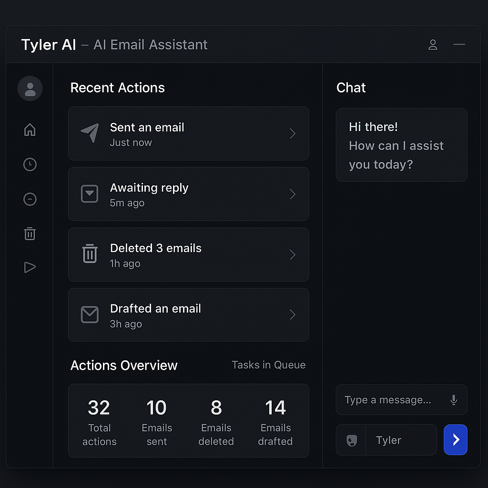

ReadME Content

# TylerAI – Your Voice-Based Email Assistant

TylerAI is a Chrome extension that lets you manage your Gmail inbox using natural voice commands. Built with JavaScript (frontend) and Python (backend), it uses OpenAI's Whisper API for transcription and GPT-4 for contextual understanding.

## ✨ Features
- Voice control for Gmail (draft, summarize, delete, archive)
- Smart name-to-email resolution using fuzzy matching
- Seamless Gmail DOM injection and UI interaction
- Real-time transcription and AI response via Whisper + GPT-4
- Multi-recipient draft handling, CC/BCC support, and reply threading

## 🛠️ Tech Stack
- JavaScript (Chrome Extension UI & logic)
- Python (Flask backend API)
- OpenAI Whisper API (transcription)
- OpenAI GPT-4 (natural language understanding)
- Gmail API + DOM scripting

## 🚀 Getting Started

### Prerequisites
- Node.js
- Python 3.9+
- Chrome
- OpenAI API key

### Setup (Frontend)
1. Clone the repo
2. Go to `frontend/` directory
3. Run `npm

### Author/Publication Details
- Authored by: Jacob Lindberg - King of Software Degeneracy
- Inspired by: Tyler Bosmeny - General Partner - YCombinator
- Performance Enhancing Drugs Used - Caffeine
- Symptoms - Bug-eyed, Persistent Pre-Frontal Cortex Migraine
- Degeneracy Score: 7.5/10

### Mock UI Web App
Here is the mock UI for the WebApp... 

### To DO
Redis BackEnd (Maybe Cron Job)
Vector Search for Email Context

